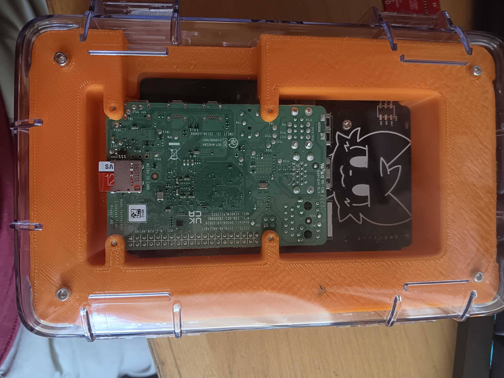
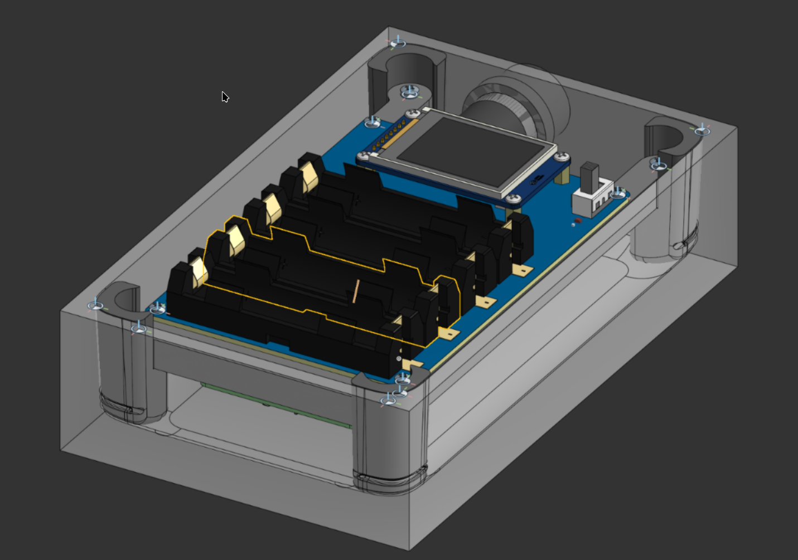

### Total time: 21hrs 30m

## Final notes:
CAD couldn't prepare me for every design issue I ran in to at the "integration hell" stage. There are a lot of minor design flaws, and I've learned a LOT. Stay tuned, I may give this a second shot, with the goal of perfecting this project (never gonna happen, but it's a good goal to aspire to).

### August 2:

Did a bunch of work on the display, and it fully works now, so...

### July 22:

Project complete!

I iterated the case mount several times over the past few days, and finally got it to a place where I like it. A funny mistake I made along the way was when I first tried adding handles, I accidentally made the attachment hole only on one side, and didn't notice until I went to go put them on:

### July 15:

All the parts have finally arrived, and I'm back from undercity! I just finished soldering everything together, though I think I might redo the standoffs for the screen with a custom 3d print. I tested the hat, and it seems I got lucky, It's outputting 5.25v which is just on the edge of the Pi's 4.75-5.25v acceptable range.

### June 24:
30m

Ordered parts after a ton of struggling with JLCPCB's website!

### June 14:
2hrs

Today is mainly preparing to submit since I'm leaving for vacation tomorrow. JLCPCB's website is still refusing to works, so I might not have a good quote on the PCBs. I cleaned up the repo, made final changes to the PCB and CAD, and went over all the guidelines. Also made some relatively minor cad changes.

### June 13:
4hrs

JLCPCB's website FUCKING SUCKS

In the very real case that PCB assembly gets pricey, my contingency plan is to solder the top myself. Also added RJ45 passthrough in CAD:

### June 12:
5hrs

Also put in screws, etc:

Took an eternity, but I finally figured out how to mount the board in there!

Today I'm back in CAD. it took me forever, and quite a few revisions, but i finally got these things that will eventually support the pi kinda working, and properly mating, The ridges were a massive pain, even though they're key to my design:

### June 11:
5 hrs

oh and i have no idea how to mount the board in the case, im thinking something like what i have drawn below, i want to make use of the existing ribs to support the pcb:

ALL HAIL OUR LORD AND SAVIOR: https://lcsc.com/product-detail/image/FH-00205_C2685098.html:

Back in CAD today, and while mocking up witrh a Pi, I realized that the header I'm using isn't quite tall enough, so I'm going to have to replace it:

(if you zoom in you'll se that the USB ports is clipping into the PCB)

### June 8:
1 hr

Copied in my power circuit from my previous trail project and got it layed out. Pic coming soon.

### June 7:
2hr

v1 of pcb layout is complete! put it in cad and now have a good basic mockup:

### June 6:
1hr

fuck around in cad/easyeda

### June 5:
2hrs

Started planning out my PCB in EasyEDA Pro, and I am now legitimately shocked how much of a struggle I can turn placing a single pin header into pf. 

### June 4:
School is finally out, so I now actually have time to get some work done. I previously started a CAD document, and now I finally linked it in this repo.

### May 19:
Set up basic repo, etc, also ordered some test components off of amazon.
