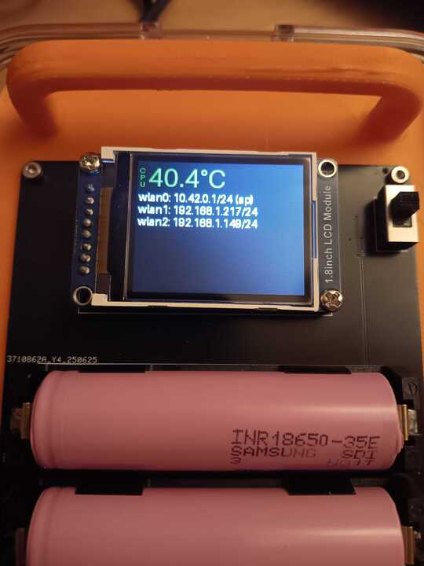
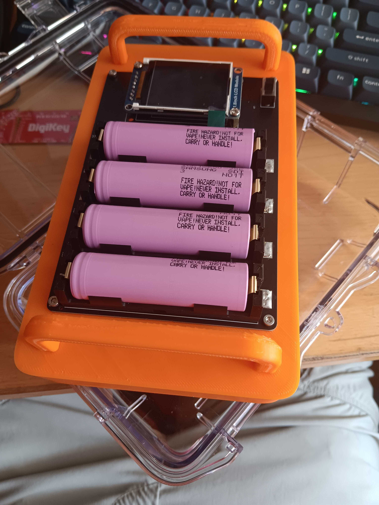

# HackPack
## Raspberry Pi based computer that you can pack in a backpack and hack on the go.

This project is the final boss of my trail project from ~1yr ago ([repo](https://github.com/TheTridentGuy/BlackboxHub), poorly documented, sorry). It's designed to be a full, battery powered Raspberry Pi setup encased in a durable, water-resistant case. It consists of a HAT (Hardware Attached on Top) that has 4 18650 batteries, and a display, mounted on a Raspberry Pi inside a Pelican M50 case. It also lets you have a full Linux machine in your backpack, that you can easily work on from a more convenient device, such as a phone. It also includes two extra WiFi interfaces for all your hacking needs.

### CAD (https://cad.onshape.com/documents/6df97bd3669b763357b27d0a/w/2eb46c9dede87bfe785ca901/e/c7fc2c6f9f332d8ca268ebb4):

### Electrical schematic:

### PCB:

### BOM (Items marked $0 I already have):
